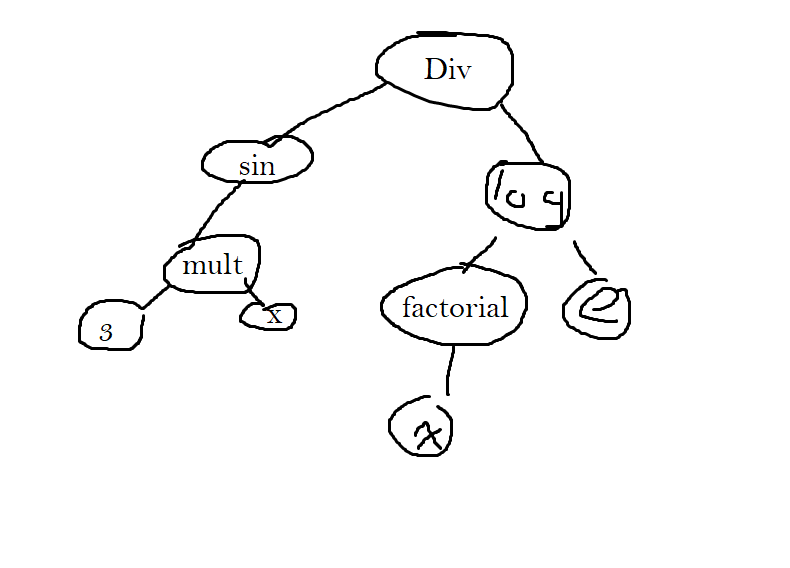

# Factoreyes
Checks for repetitiveness in homework.

## The Primary Algorithim
Our project uses a machine learning algorithim to identify problems which have similar behaviors to one another. For this task we used a RNN (recursive neural network).

### Gathering Data
For this hackathon we chose to primarily focus on only one type of math problems. We chose to center our project around identifying, classifiying, and analyzing factoring problems. For our machine learning algorithim to work we needed data to train it off of. We focusing on factoring problems but, the way we generated the data for the RNN was more general.

First, we created a generate a Latex string and then we used sympy to turn it into a parsed string. Since, our machine learning project relied the input being in the form of a binary tree. We took the parsed string and turned it into a binary tree. For the quadartic x^2 + 3x -4 it might look like the following.

Our algorithim for turning expressions into tree doesn't stop with polynomials. It also allows for more advanced functions. Below is the following binary tree for sin(3x)/ln(x!)

